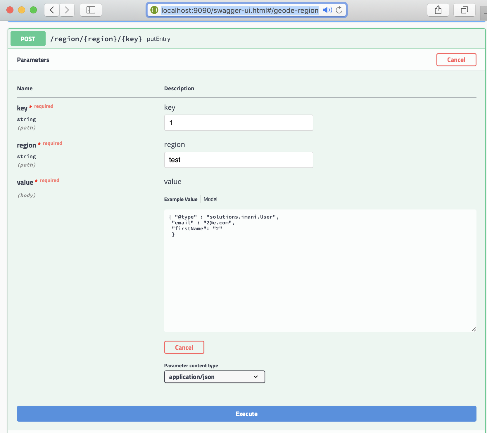

# Apache Geode/GemFire Apache Kakfa Connector

This project is a BETA Spring Boot application that moves JSON based data to and from
 [Apache Geode](https://geode.apache.org/) and [Apache Kafka](https://kafka.apache.org/).

The initial purpose was to support moving data from [Pivotal GemFire](https://pivotal.io/pivotal-gemfire) to
 [Pivotal Cloud Cache/PCC](https://pivotal.io/pivotal-gemfire) or between PCC clusters using Apache Kafka as a transportation mechanism.

This application also uses [Spring Batch](https://spring.io/projects/spring-batch), [Spring Data Geode](https://spring.io/projects/spring-data-geode), [Spring Kafka](https://spring.io/projects/spring-kafka),
 [Spring Security](https://spring.io/projects/spring-security).


### Use Cases

- Fast data cache access of aggregated streams data by partitioned key (think [KTables](https://docs.confluent.io/current/streams/concepts.html))
- Pivotal GemFire to Pivotal Cloud Cache (PCC) migration into Vmware Tanzu Cloud Foundry using Apache Kafka as a transportation mechanism.
- Apache Geode cache data ingestion into  [Spring Cloud DataFlow](https://spring.io/projects/spring-cloud-dataflow) data pipelines


## Start/Setup Kafka

- [Download Apache Kafka](https://kafka.apache.org/downloads)
- Clone an Open source scripts to start kakfa project. See https://github.com/ggreen/kafka-devOps (or see confluent CLI)
- git clone https://github.com/ggreen/kafka-devOps.git
- cd kafka-devOps
- create file ./setenv.sh (modify the following exports as needed)

```bash
      export KAFKA_HOST=localhost
      export KAFKA_HOME=<install-direct> ex: /devtools/integration/messaging/apacheKafka/kafka_2.11-2.3.0/
      export CONFIG_DIR=./config
      export KAFKA_BROKER_PORT=9092
      export ZOOKEEPER_PORT=2181
```

- cp -r $KAFKA_HOME/config .
- cp $KAFKA_HOME/config/zookeeper.properties ./zookeeper.properties
- ./startZookeeper.sh
- ./startKafka.sh
- ./createTopic.sh <topic> <partitions> <replication-factor> ex: ./createTopic.sh test 3 1


## Start/Setup Apache Geode


- Download binary for [Apache Geode](https://geode.apache.org/releases/)
- cd <APACHE-GEODE-DIR>/bin
- ./gfsh
- gfsh>start locator --name=locator
- gfsh>start server --name=server1 --locators=localhost[10334] --server-port=50001
- gfsh>create region --name=test --type=PARTITION_REDUNDANT
- gfsh>create region --name=test2 --type=PARTITION_REDUNDANT

## Load Apache Geode

- Use the following to insert PDX data into Apache Geode
- https://github.com/Pivotal-Data-Engineering/dataTx-geode-rest-kotlin-app
- Goto http://localhost:9090/swagger-ui.html



# User Guide

This application exposes Spring Batch
jobs that can be started through Swagger.


## From Geode to Kafka

Sample screen shot to start job to move from Apache Geode
to Apache Kakfa.


You can use the kafka-devOps showMessage.sh script to view the data


    kafka-devOps$ ./showMessages.sh test
    {"keyClassName":"java.lang.String","keyString":"1","valueJson":"{\n  \"@type\" : \"solutions.imani.User\",\n  \"email\" : \"2@e.com\",\n  \"firstName\" : \"2\"\n}"}


## From Kafka to Geode

Sample screen shot to start job to move from Apache Kafka
to Apache Geode.


# Spring Batch Job Repository Database

## H2 Embedded Database (DEV only)

An in-memory H2 database is configured by default to store Spring Batch job
repository statuses.

You can change those parameters by adding the
following spring properties


    spring.datasource.url=jdbc:h2:mem:testdb
    spring.datasource.driverClassName=org.h2.Driver
    spring.datasource.username=sa
    spring.datasource.password=password
    spring.jpa.database-platform=org.hibernate.dialect.H2Dialect


You can also use a file-based storage by changing the URL
spring.datasource.url:

    spring.datasource.url=jdbc:h2:file:/data/demo


Use the "h2-console" endpoint to access the H2 database to query for job statuses.

Example

    http://localhost:8080/h2-console


    

See the configuration spring.datasource properties for connection details.

You can query the Spring Batch Job Repository tables to view statuses.


